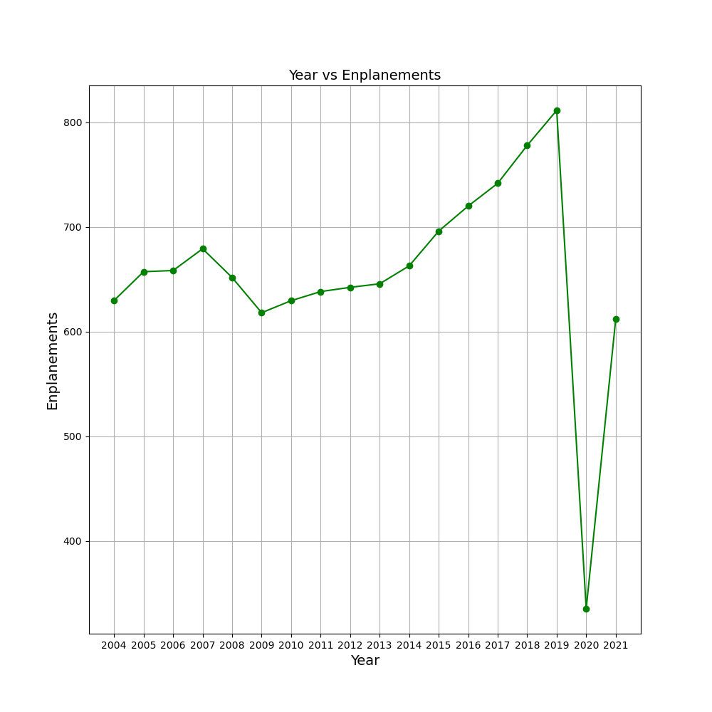
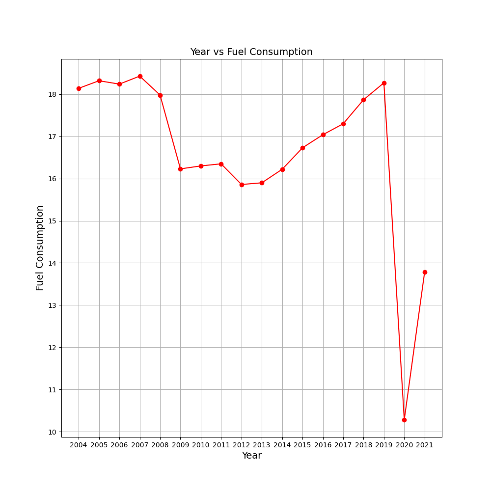
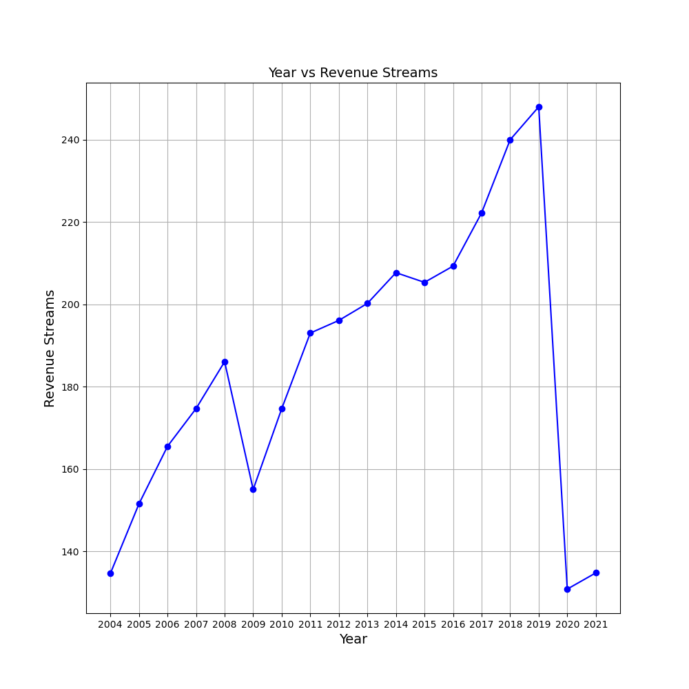
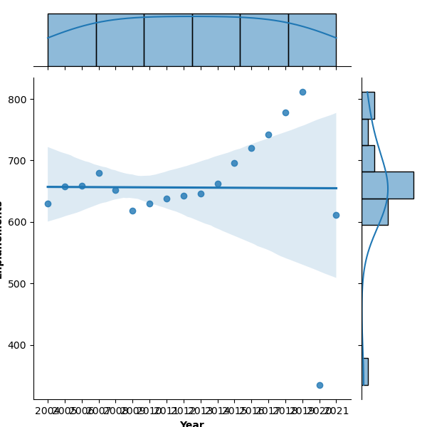
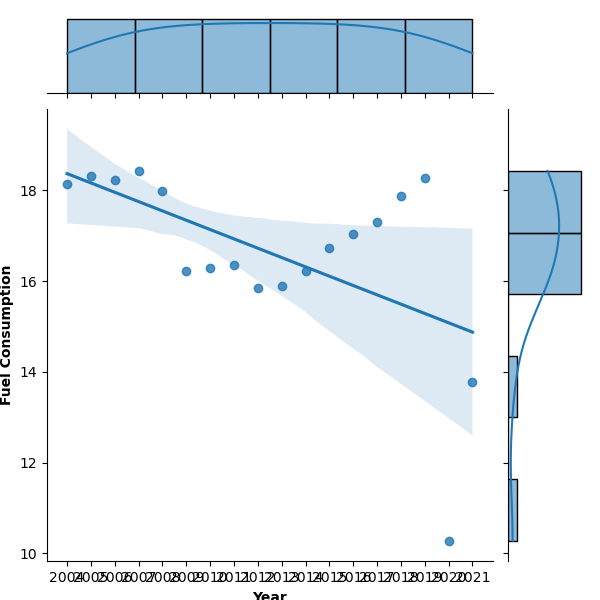
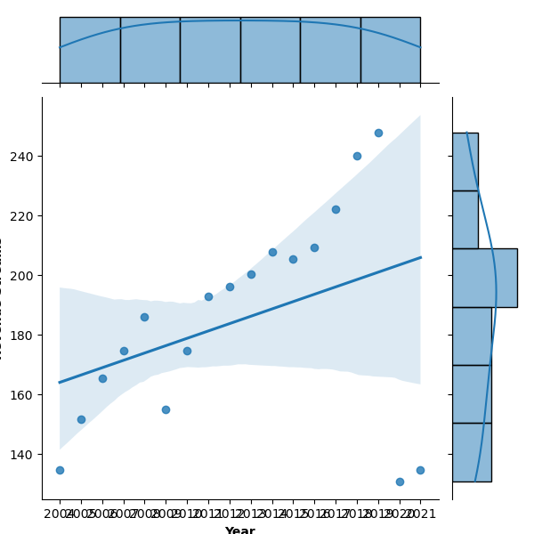
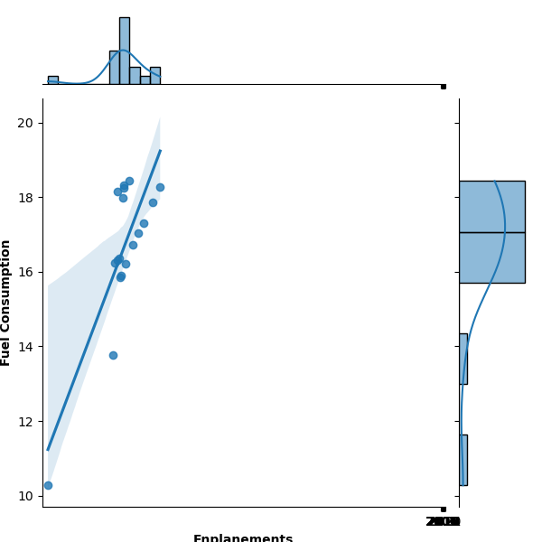
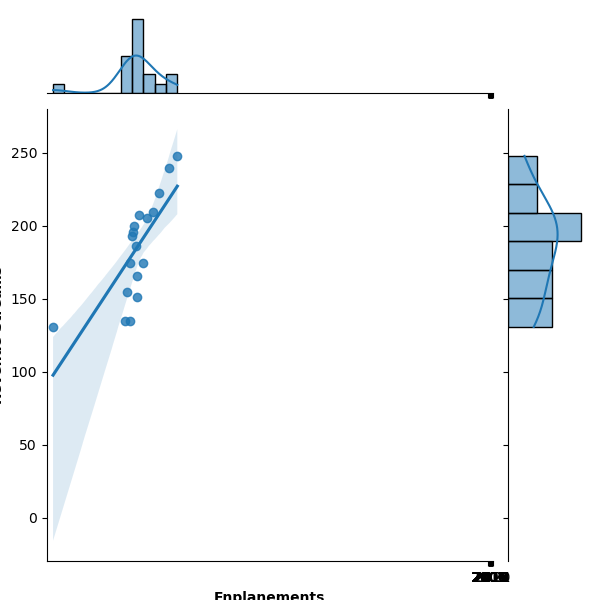
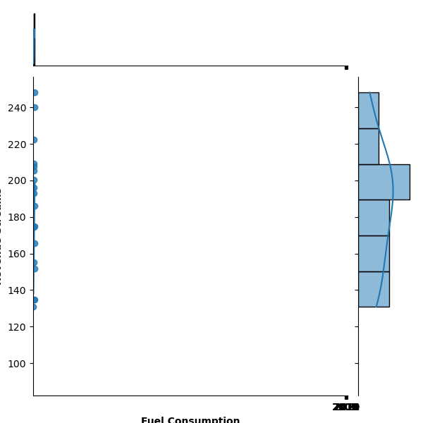

# Covid's effect on air travel
A group project for intro to data science that analyzes the impact of Covid 19
on airline revenue streams, fuel consumption and enplanements

### Contents
- [covidandairtravel.py](covidandairtravel.py) - A Python program that uses least squares regression to analyze revenue streams, fuel consumption and enplanements then uses matplotlib and seaborn to graph the results
- graphs - The graphs generated by covidandairtravel.py
- data
   - [covidandairtravel.csv](graphs/covidandairtravel.csv) - A CSV text file containing the combined datasets for revenue streams, fuel consumption and enplanements

### Enplanements

### Fuel Consumption

### Revenue Streams

### Enplanements Regression

### Fuel Consumption Regression

### Revenue Streams Regression

### Enplanements vs Fuel Consumption Regression

### Enplanements vs Revenue Streams Regression

### Fuel Consumption vs Revenue Streams Regression

